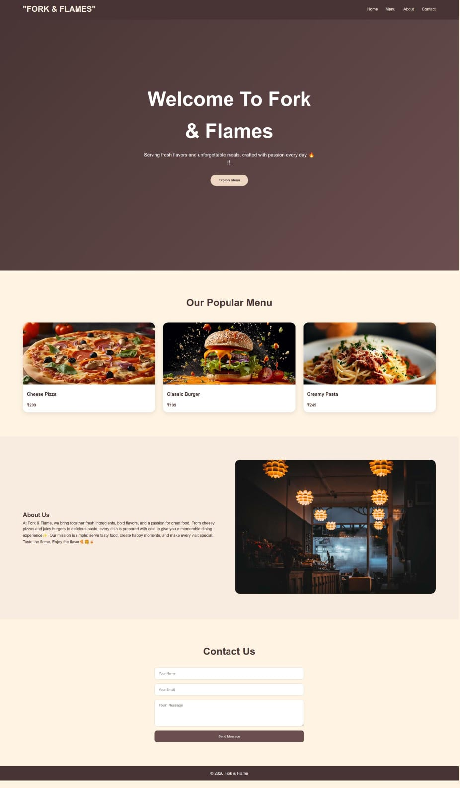

 🍽️ Fork & Flames

Fork & Flames is a modern and fully responsive restaurant website built using HTML5 and CSS3. The project was developed as part of a Frontend Development training program to demonstrate responsive web design principles, modern UI/UX practices, and mobile-first development.

The website features a premium restaurant-inspired interface, responsive navigation menu, interactive food menu cards, smooth scrolling, and a contact section. It is designed to provide a seamless experience across desktop, tablet, and mobile devices using CSS Grid, Flexbox, and Media Queries.
                      
## 🌐 Live Demo

🔗 [View Website](https://nabihaz2606.github.io/Decodelabs__task2/)

# Screenshots of output

## 🚀 Features
- Responsive Web Design
- Mobile-Friendly Navigation
- CSS Grid & Flexbox
- Interactive Menu Cards
- Contact Form
- Modern UI/UX Design

## 🛠️ Technologies Used
- HTML5
- CSS3
- CSS Grid
- Flexbox
- Media Queries

 ##Learning Objectives
This project demonstrates:
Mobile-First Design
Responsive Layout Development
Modern CSS Techniques
User Interface Design
Frontend Development Best Practices

 ##Supported Devices
Mobile Phones
Tablets
Laptops
Desktop Computers

Author
Nabiha.

Frontend Development Project – DecodeLabs

